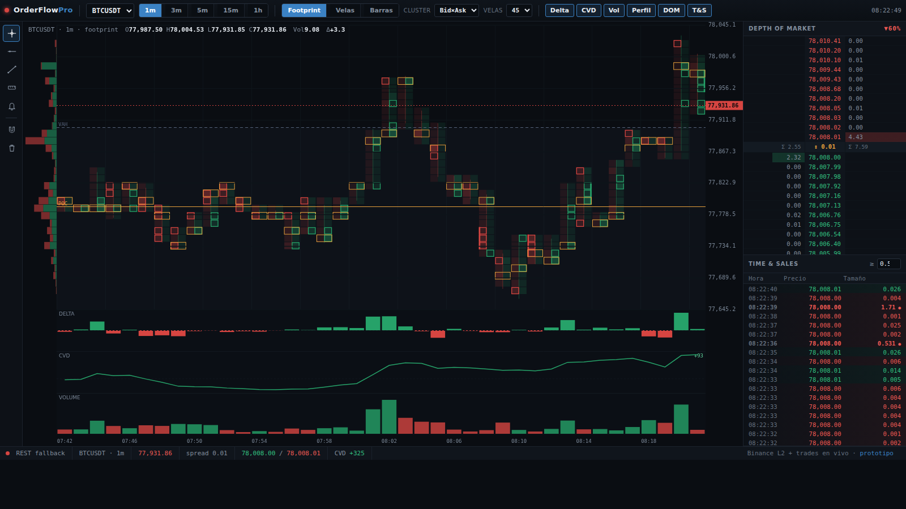

# OrderFlow Pro — terminal de order flow (estilo ATAS)

Terminal de trading de **order flow** para cripto, con datos **reales** de Binance
(REST para el seed + **WebSocket** en vivo: trades, velas y **order book L2**).
Diseño profesional y denso, sin adornos.



## Paneles (como ATAS)

- **Gráfico** con 3 tipos: **Footprint** (cluster bid×ask por nivel), **Velas** y **Barras**.
  - Modos de cluster: **Bid×Ask**, **Delta** o **Volumen**.
  - Imbalances diagonales resaltados, **stacked imbalance**, **POC** por vela.
- **Perfil de volumen** de sesión (azul sobre POC, rojo debajo) + **vPOC / VAH / VAL** + **VWAP**.
- **Paneles de indicadores** apilados y alineados al tiempo: **Delta**, **CVD**
  (delta acumulado) y **Volumen**.
- **DOM — Depth of Market**: escalera L2 real (bids/asks, tamaños con barra,
  spread, totales Σ, imbalance del libro). Marca **❄ iceberg** y **◆ absorción**.
- **Time & Sales**: cinta de trades en vivo (hora, precio, tamaño), coloreada por
  lado, con resaltado de **trades grandes** (●) y umbral configurable.
- **Crosshair** con etiquetas de precio/tiempo y **leyenda OHLCV+Δ** arriba a la izquierda.
- **Herramientas de dibujo**: línea horizontal, tendencia, regla (mide $/%/velas),
  alerta de precio, imán (snap a OHLC) y borrar.
- **Barra de estado**: conexión, símbolo, último, spread, mejor bid/ask, CVD.

## Detecciones

| Señal | Fuente | Cómo |
|---|---|---|
| **Iceberg** | **L2 + trades** | volumen ejecutado ≫ tamaño mostrado por el libro + recargas → orden oculta |
| **Absorción** | **L2 + trades** | nivel de reposo grande que aguanta agresión fuerte sin romperse |
| **Imbalance diagonal** | footprint | `ask[n]` vs `bid[n-1]` (compra) / `bid[n]` vs `ask[n+1]` (venta), ratio ≥ 300% |
| **Stacked imbalance** | footprint | ≥ 3 imbalances consecutivos en la misma dirección |

## Datos (Binance, sin API key)

| Qué | Fuente |
|---|---|
| Velas + delta por vela | `klines` / `@kline` (incluye taker-buy) |
| Perfil / vPOC / VAH / VAL | derivado de las velas |
| Footprint (bid/ask por nivel) | `aggTrades` (seed) + `@aggTrade` (live) |
| Order book **L2** | `/api/v3/depth` (seed) + `@depth20@100ms` (live) |
| Time & Sales | `aggTrades` (seed) + `@aggTrade` (live) |

El servidor Python arma el seed y lo cachea; el streaming en vivo (trades, velas,
libro) lo hace el navegador directo contra Binance. Si el WebSocket está bloqueado,
cae a *polling* REST automáticamente.

## Cómo correrlo

Solo **Python 3.8+**, sin dependencias externas:

```bash
python3 orderflow/server.py     # http://localhost:8787
```

- Toolbar: instrumento · TF (1m–1h) · tipo (Footprint/Velas/Barras) · modo cluster ·
  nº de velas · chips de paneles (Delta/CVD/Vol/Perfil/DOM/T&S).
- Deep-links: `?symbol=ETHUSDT&tf=5m&type=candles`.
- Variable `ORDERFLOW_PORT`.

## Endpoints

- `GET /api/seed` — OHLC + perfil + value area + footprint real.
- `GET /api/depth` — snapshot del order book L2.
- `GET /api/trades` — trades recientes (seed del Time & Sales).

## Límites del prototipo (honestos)

- El stream `@depth20` da los **20 niveles** cercanos al spread; para un heatmap de
  liquidez completo tipo Bookmap haría falta el libro completo con diffs (`@depth`).
- No es literalmente ATAS: es un clon funcional de sus vistas principales
  (footprint, DOM, T&S, indicadores, dibujos). No incluye ejecución de órdenes,
  cuenta de broker, backtesting ni todos sus indicadores.
- Sin persistencia ni login: demo técnica de una sola página.

## Siguientes pasos posibles

- Heatmap de liquidez histórico (libro completo con diffs incrementales).
- Alertas push/webhook sobre iceberg, absorción y stacked imbalance.
- Guardar/reproducir sesiones (replay de footprint + libro + cinta).
- Más indicadores (VWAP bands, delta divergence, cumulative delta por sesión).
