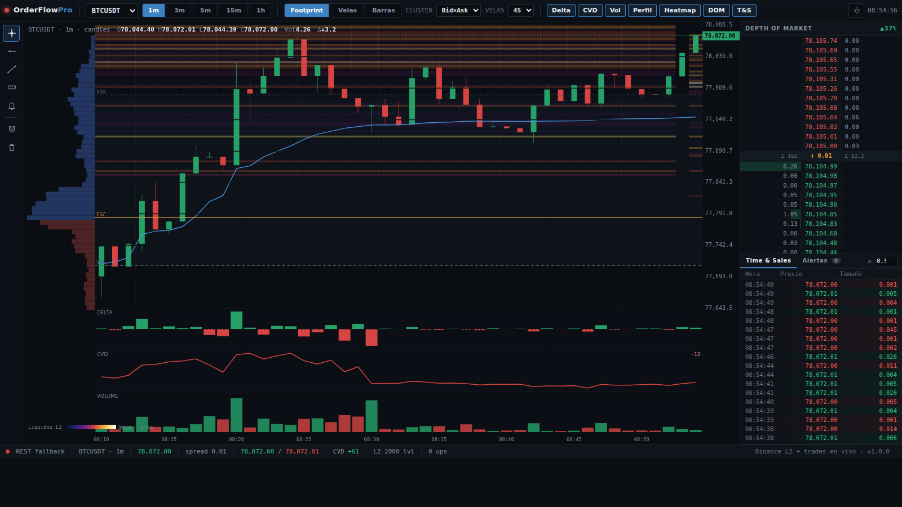

# OrderFlow Pro

A professional, browser-based **order-flow trading terminal** for crypto — real
Binance market data, no API key, no build step, no external dependencies.
Footprint charts, full L2 depth of market, Bookmap-style liquidity heatmap,
Time & Sales, order-flow detections, alerts and drawing tools.


> Live liquidity heatmap over candles:
> 

---

## Features

**Charting**
- Chart types: **Footprint** (bid×ask clusters), **Candles**, **Bars**.
- Footprint cluster modes: **Bid×Ask**, **Delta**, **Volume**; configurable
  ticks-per-row.
- Session **volume profile** (blue above POC / red below), **vPOC / VAH / VAL**,
  **VWAP**.
- Aligned indicator panes: **Delta**, **Cumulative Delta (CVD)**, **Volume**.
- Crosshair with price/time labels and an OHLCV+Δ legend.

**Order book (L2)**
- **Full depth book** maintained via REST snapshot + incremental `@depth` diffs
  (correct Binance sync protocol with gap-detection and automatic re-sync).
- **Depth of Market** ladder: sizes, spread, cumulative totals, book imbalance.
- **Liquidity heatmap** (Bookmap-style) layered behind the chart.

**Order-flow detections**
- **Iceberg** (executed volume ≫ displayed size + refills — needs L2).
- **Absorption** (large resting level that holds under heavy aggression).
- **Diagonal imbalance** (ratio configurable) and **stacked imbalance**.

**Time & Sales**
- Live print feed, side-coloured, large-trade highlighting, configurable threshold.

**Alerts**
- **Price-cross** and **order-flow** alerts (iceberg / absorption / stacked)
  that fire a toast, a sound and a browser notification. Managed in the Alerts panel.

**Tools & UX**
- Drawing tools: horizontal line, trendline, ruler ($/%/bars), price alert,
  magnet snap, clear.
- Settings modal (imbalance %, stacked min, cluster ticks, big-trade threshold,
  sound, notifications, heatmap).
- **Keyboard shortcuts**, **deep-links**, and **persistence** of your whole
  workspace (symbol, timeframe, layout, drawings, alerts) via `localStorage`.
- Status bar: connection, price, spread, best bid/ask, CVD, book levels, updates/s.
- Automatic **REST fallback** if the WebSocket is blocked; **auto-reconnect**.

## Architecture

```
Browser (ES modules, canvas)                Server (Python stdlib http.server)
├─ app.js        orchestration + render     ├─ /api/seed     OHLC+profile+footprint (cached)
├─ footprint.js  cluster model + detections ├─ /api/depth    L2 snapshot (≤5000)
├─ orderbook.js  full L2 book + diff sync    ├─ /api/trades   recent aggTrades
├─ heatmap.js    liquidity heatmap buffer   ├─ /api/health   liveness + upstream
└─ alerts.js     alerts engine              └─ /api/config   symbols / intervals / version
        │                                            │
        └── live WebSocket ─────────────────► Binance market data (data-*.binance.vision)
            @aggTrade · @kline · @depth@100ms
```

The server only builds the historical **seed** and proxies snapshots; all live
streaming (trades, klines, full order book) runs **directly in the browser**
against Binance, so the backend stays tiny and stateless.

## Data sources (Binance public, no API key)

| Signal | Source |
|---|---|
| Candles + per-candle delta | `klines` / `@kline` (taker-buy volume) |
| Volume profile / vPOC / VAH / VAL | derived from candles |
| Footprint (bid/ask per level) | `aggTrades` seed + `@aggTrade` live |
| Order book L2 | `/api/v3/depth` snapshot + `@depth@100ms` diffs |
| Time & Sales | `aggTrades` seed + `@aggTrade` live |

## Run

Requires **Python 3.8+** only — no `pip install`, no Node build.

```bash
python3 server.py                 # http://localhost:8787
# or
./run.sh                          # runs tests, then serves
./run.sh test                     # just the tests
```

Environment: `ORDERFLOW_HOST` (default `0.0.0.0`), `ORDERFLOW_PORT` (default `8787`).

### Docker

```bash
docker build -t orderflow-pro .
docker run -p 8787:8787 orderflow-pro     # includes a /api/health healthcheck
```

## Keyboard shortcuts

`F` footprint · `C` candles · `B` bars · `H` heatmap · `V` crosshair ·
`A` price-alert tool · `S` settings · `+` / `−` more/less candles · `Esc` close.

## Deep-links

`/?symbol=ETHUSDT&tf=5m&type=candles&heatmap=1`

## Tests

```bash
python3 -m unittest discover -s tests -v
```

Covers the server's order-flow math (delta, volume profile, value area, tick
sizing). Detection logic (iceberg/absorption/imbalance) lives in the browser
modules and is exercised live against the stream.

## Notes & limits

- Uses Binance's public **market data** only — this is analysis/visualisation,
  **not** an execution platform (no broker account, no order placement).
- The liquidity heatmap builds **forward** from load (past book state can't be
  reconstructed from public data) — exactly how a live depth heatmap behaves.
- Detections are heuristics tuned for the near-spread book; treat them as signals,
  not certainties.

## Roadmap

- Persisted heatmap history / session replay.
- Server-side alert delivery (webhook / Telegram / email).
- Multi-chart layouts and a watchlist.
- More studies (VWAP bands, delta divergence, HVN/LVN zones).
